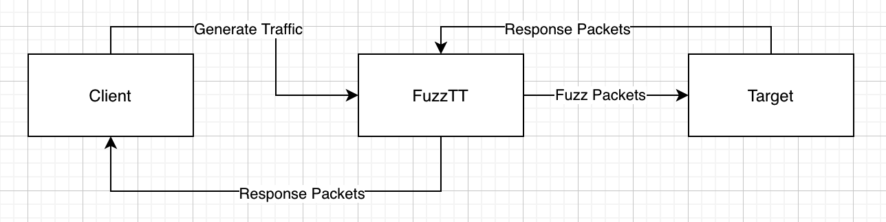

# MQTT Fuzzer/ FuzzTT

#### Inspiration

The idea is to have a plug and play solution for fuzzing MQTT. Most solutions out there need to be customized or are expensive to purchase. MQTT fuzzer is a TCP proxy at it's core with the ability to capture MQTT traffic (supports 5.0 and 3.1) and sends fuzz controlled packets to a remote broker or client.

Every fuzz packet that receives a response from the target device is logged and is stored in the ```output``` folder. 

If the length of the payloads is not set to a specific value, MQTT fuzzer generates payloads of random lengths for the target device. However, if the length of the payload to be used is specified, FuzzTT increases the frequency of payloads for the specified length by close to 75% while the packets are of random lengths. These packets can also be throttled to support connections with low bandwidths. 



> The above image contains an overview of the MQTT fuzzer internals.

Use this tool, if you are interested in fuzzing a MQTT client or a broker target. If you have the need to customize the implemented payload generation, take a look at ```fuzzit()``` in the ```fuzzer/fuzzer.go``` file. The possibilities are endless. 

**Note**

+ FuzzTT currently supports unencrypted TCP (mqtt) connections. TLS support (mqtts) is being worked on and an update will be pushed in the coming weeks.

+ FuzzTT can be preconfigured using config.json. These preconfigured settings can be over ridden during runtime by supplying relevant command line arguments.

#### Installation

+ Download a prebuilt binary from the releases page. Run the downloaded binary.

+ Clone this repository. Build and run the binary.
  
  ```bash
  cd mqttprox
  go build mqttprox.go
  ```

#### Example Usage

```bash
./mqttprox -l 127.0.0.1 -p 1988 -r  remoteTarget:1883 -f 1989 -P 12
```


##### Options Supported

```bash
  -P int
        Define the length of the variable header and payload
  -c string
        Use a config file (set TLS ect) - Commandline params overwrite config file
  -cert string
        Use a specific ca cert file
  -clientCert string
        A public client cert to use for mTLS
  -clientKey string
        A public client key to use for mTLS
  -d int
        Define time in milliseconds to wait before making a request. Default vaue is 0 seconds (default 1)
  -f int
        Local Port to listen to the fuzzer
  -key string
        Use a specific ca key file (must be set if --cert is set)
  -l string
        Local address to listen on
  -p int
        Local Port to listen on
  -r string
        Remote Server address host:port
  -s    Create a TLS Proxy
```
